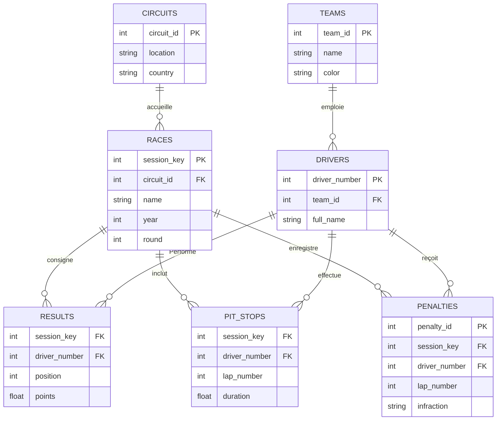

# Document de Conception de la Base de Données (DESIGN.md)

## Description des Entités et des Relations

Pour notre projet nous avons choisis de concevoir une base de donnée sur les saisons de Fomrule 1 ;

* **`RESULTS`** : Enregistre le classement final de chaque pilote par course. C'est la source principale pour le calcul des classements en championnats (Teams ou individuel).
    * **Relation** : Connectée à `RACES` (via `session_key`) et `DRIVERS` (via `driver_number`).
* **`PIT_STOPS`** : Détaille chaque arrêt aux stands (numéro du tour et durée).
    * **Relation** : Liée aux pilotes pour analyser la performance des mécaniciens par écurie.
* **`PENALTIES`** : Répertorie les infractions relevées par la FIA.
    * **Relation** : Chaque pénalité est rattachée à un pilote et à une session spécifique.
* **`RACES`** : Définit chaques course grâce à la `session_key` (identifiant unique de l'API openF1). Elle inclut l'année (`year`) pour séparer les saisons 2024 et 2025.
    * **Relation** : Connectée au circuit afin de savoir où s'est déroulé l'événement grâce au `circuit_id`.
* **`TEAMS`** : Liste les constructeurs avec leurs noms et couleurs officielles.
    * **Relation** : Emploie des pilotes qui concours aux "races"
* **`DRIVERS`** : Identifie les pilotes. Nous utilisons le `driver_number` comme clé primaire grâce à une autoincrémentation.
    * **Relation** : Est rélié aux teams grâce à leurs `id` et à leurs couleurs officielles
* **`CIRCUITS`** : Stocke la localisation et le pays des tracés visités.
    * **Relation** : C'est l'endoit où se passe la course, relié à Races grâce au `circuit_id`
---

## Diagramme Entité-Relation (ER)

Le diagramme ci-dessous représente les liens logiques et les clés étrangères (FK) du système :

## Explication des choix de conception 

Nous avons choisis ces entités car elle nous parraissent être les plus évidente quand il s'agit d'analyser les résultats en F1, elle sont aussi parmi les tables les plus "simple" à scrapper grâce à l'accès à de nombreuses API open source.
Cette dernière nous a permi de mettre en avant les deux clé primaire qui ne sont pas autoincrémenté par sql, le `driver_number` et la `session key` qui sont les pivots principaux de cette analyse et permettent notamment de fluidifier les données, et de garantir une bonne coordination dans les relations entre les entités.

Nous avons donc choisis 3 type de données ;

* **Les INTEGER**, pour les clés, ce qui permet une optimisation des temps de jointure.
* **Les FLOAT**, Pour les temps
* **Les TEXT**, Pour les infractions car cela permet de stocker à la fois la sanction mais egalement la raison de celle-ci.

## Les limites de notre modèle

* **Les sprints**, lorsque l'on compare au classement final des deux saisons observés, on remarque un total de point différent qui s'explique par l'absence des courses sprints dans notre modèle, ici on prend seulement en compte les résultat des GP ce qui fausse l'analyse par rapport aux résultats réel, cela permet néanmoins d'avoir un autre point de vu et de voir quelles sont les équipes les plus performantes GP.
* **La Gestion des transferts**, La relation Pilote-Écurie est modélisée de manière statique. Pour les pilotes ayant changé d'écurie entre 2024 et 2025 (ex: Hamilton chez Mercedes puis Ferrari), le changement est effectuée dynamiquement directement dans des Vues SQL car nous n'avons pas trouvé de solution plus simple et viable afin de réaliser cette améliaration.
